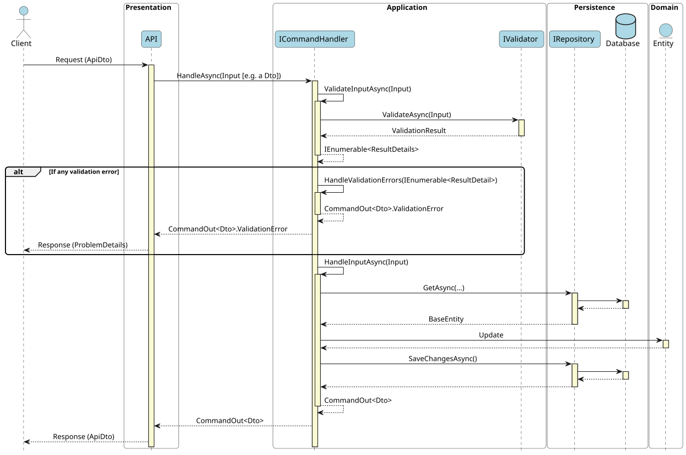
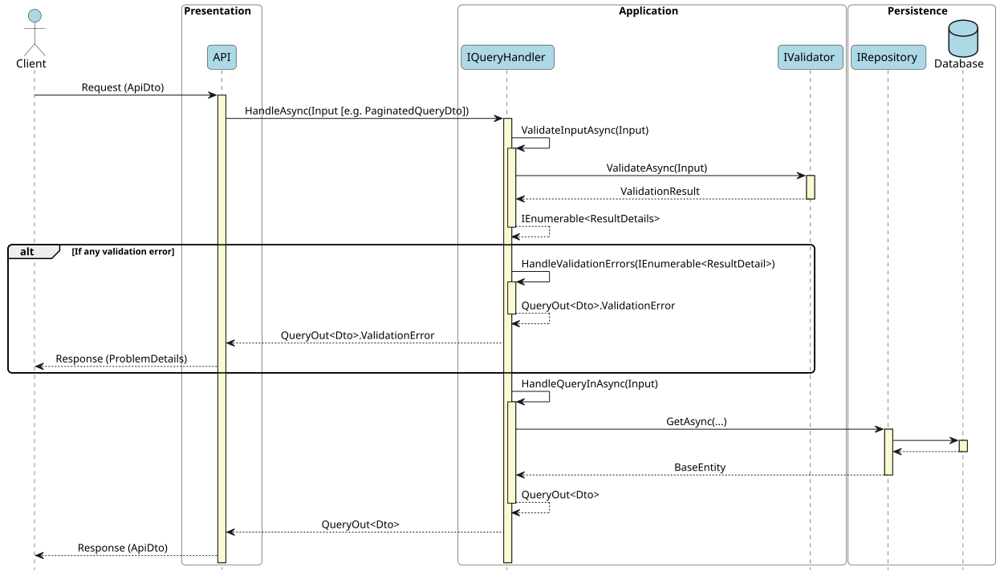
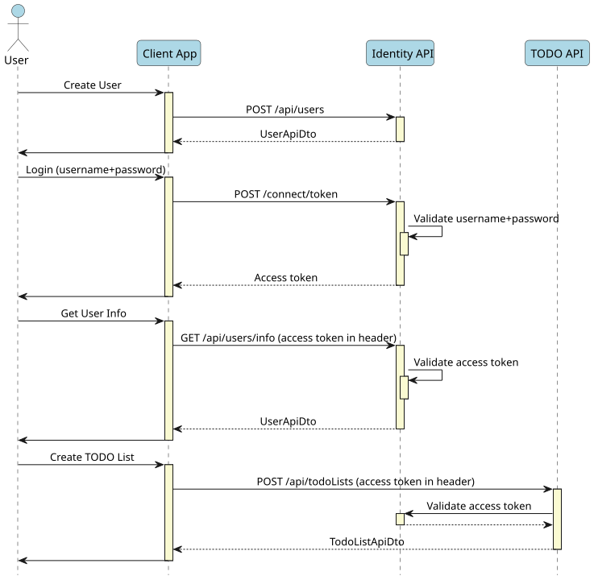

[](https://www.nuget.org/packages/PMart.Modular.Api.template)
[](https://www.nuget.org/packages/PMart.Modular.Api.template)
[](https://github.com/p-martinho/Modular.Api.Template/actions/workflows/build-and-test.yaml)
[](https://github.com/p-martinho/Modular.Api.Template/actions/workflows/codeql-analysis.yaml)

# Modular API Solution

This is a .NET template to create a modular monolith with several ASP.NET Core APIs.

The idea is to create, fast and easy, an enterprise level solution, with a layered architecture, with the ability to have different modules in the same solution with a clean structure.

# Requirements

* [.NET 10.0 SDK](https://dotnet.microsoft.com/en-us/download/dotnet/10.0) (or later)
* [Docker Desktop](https://www.docker.com/)
* [EF Core CLI Tool](https://learn.microsoft.com/en-us/ef/core/cli/dotnet)

# Getting Started

## Installation

First, you need to install the template:

```
dotnet new install PMart.Modular.Api.Template
```

Once installed, you can see the available options running the command:

```
dotnet new mod-api --help
```

## Create a New Solution

Once installed, create a new solution using the template:

```
dotnet new mod-api -n YourSolutionName
```

To add support for Docker and Docker compose, add the option `--with-docker`:

```
dotnet new mod-api -n YourSolutionName --with-docker
```

## Add a New Module

After having the solution created, you can add new modules, using the `--add module` option.

**In the root folder of the solution**, run the command:

```
dotnet new mod-api --add module --module-name YourNewModuleName
```

If you want to add support for Docker in the new module, add the option `--with-docker`:

```
dotnet new mod-api --add module --module-name YourNewModuleName --with-docker
```

After creating the new module, add it to **Aspire** (check [here](#aspire) how).
If **Docker** is used, add the new module to `docker-compose.yml` and `docker-compose.override.yml` (check how it is done for the sample modules).

## Add Tests for the New Module

After adding the new module, you can add test projects for the new module, using the `--add tests` option (the name of the module must be provided):

```
dotnet new mod-api --add tests --module-name YourNewModuleName
```

## Run

Locally, you only have to run the `Aspire.AppHost` project. It requires **Docker Desktop** running, for the database.

Navigate to [https://localhost:7107/scalar](), to see the sample **Identity API** documentation page
and navigate to [https://localhost:7217/scalar]() to see the sample **Todo API** documentation page.

You can test the sample APIs, using the provided examples in the `.http` files:
[Identity.Presentation.Api.http](./src/Identity/Identity.Presentation.Api/Identity.Presentation.Api.http) and [Todo.Presentation.Api.http](./src/Todo/Todo.Presentation.Api/Todo.Presentation.Api.http).

# Design and Architecture

* **Architecture**:
  * Layered Architecture
  * Modular Monolith Architecture
* **Patterns**:
  * Command Query Responsibility Segregation ([CQRS](https://en.wikipedia.org/wiki/Command_Query_Responsibility_Segregation))
  * Domain Driven Design ([DDD](https://en.wikipedia.org/wiki/Domain-driven_design))
  * [Repository pattern](https://learn.microsoft.com/en-us/dotnet/architecture/microservices/microservice-ddd-cqrs-patterns/infrastructure-persistence-layer-implementation-entity-framework-core#using-a-custom-repository-versus-using-ef-dbcontext-directly)

The solution is structured in **modules**. And each module is structured in a **Layered Architecture**, with the layers: **Presentation**, **Application**, **Domain**, **Persistence** and **Common** (described [in the next section](#layers-and-modules)).

Everything in software architecture is relative, there's no absolutely right solution, it all "depends". Therefore, don't expect I will argue that this is the greatest.
I found other great templates, for instance, using the [Clean Architecture](https://blog.cleancoder.com/uncle-bob/2012/08/13/the-clean-architecture.html). Please check them in the section [References](#references).

I found patterns that seem to me unnecessarily complex, especially for less experienced developers.
The goal of the template is to provide a solution with a clean structure, simple, but at the same time with some layer of abstraction, and following the [SOLID](https://en.wikipedia.org/wiki/SOLID) principals.

The **Layered Architecture** is straightforward, well-known, and suitable for smaller applications (better than the all-in-one architecture anyway).

The solution could be even simpler, for small playground applications or personal applications (for instance, just one project per module, like the MVC pattern, or just one project with all the modules).
I tried to get the balance. I think this solution is enterprise level (not for microservices context, this is a modular monolith) and also simple enough to use in small projects, keeping the decoupling, clean code, and [SOLID](https://en.wikipedia.org/wiki/SOLID) principals.

I tried to keep the dependencies at the minimum, as discussed in the section [Technologies and Dependencies](#technologies-and-dependencies).
Therefore, it was easy to decide to not use __MediatR__ (not even taking into consideration it is becoming commercial). Instead, the solution applies the [CQRS pattern](https://martinfowler.com/bliki/CQRS.html) using command handlers and query handlers, that are called directly and explicitly.
This way, it is easier to debug and understand what is happening instead of just sending a message and then search for the handlers of the message. And it has also performance benefits.
I totally agree that using __MediatR__ has a lot of benefits, but the intention here was only to keep things simpler and with the fewer dependencies possible.

At the **Persistence** layer, the decision was to use a [Repository pattern](https://learn.microsoft.com/en-us/dotnet/architecture/microservices/microservice-ddd-cqrs-patterns/infrastructure-persistence-layer-implementation-entity-framework-core#using-a-custom-repository-versus-using-ef-dbcontext-directly). 
Repository is controversial, and is so much easier (and not wrong at all) to use the EF Core `DbContext` directly. But, if we keep Repository simple, I don't think it is a bad idea:
* It helps on testing the application layer (the business logic doesn't need to worry about the queries, the repository can be mocked);
* It isolates the responsibility for the queries and other persistence operations in the repositories (that then can be tested independently, with a real database);
* Keep the flexibility: it is open to extension (the `DbContext` is available for the repository implementations).

In conclusion, the solution tries to be not that complex, but with a level of complexity that .NET developers are used to (we can find very simple templates, very fast to get a small project working, but that was not the intention).

## Layers and Modules

Each **module** is divided in 5 layers: **Presentation**, **Application**, **Domain**, **Persistence** and **Common**. Each layer of a module is implemented in one project, inside the module folder (check the [solution structure](#logical-solution-structure)).
And each layer has its own test project, in each module. The layers are briefly explained next.

The solution includes a set of projects called `SharedCore`. These projects, one for each layer, include abstractions, base classes, services registration, etc., that are common and used by every module.

### Presentation

This is the layer related to the interaction with the "outside world". It is where the API endpoints are configured and exposed. It may include a Web application, as well (for instance, a Razor pages project).
It includes: endpoints and DTOs, the configuration of the authentication and authorization, OpenApi documents, OpenTelemetry configuration, health checks, middleware, API versioning, logging configuration, etc.
It does not include: any kind of business logic or rules, any kind of validation (except the contracts enforced by the API DTOs). It should not depend on anything from **Domain** or **Persistence**.
This layer does not know anything of how to handle the requests, it just maps the requests to commands or queries and sends them to the **Application** layer and then maps the result to a response.

### Application

This layer just exposes interfaces of command handlers and query handlers, following the [CQRS](https://en.wikipedia.org/wiki/Command_Query_Responsibility_Segregation) pattern.
All the business logic is implemented here. This layer works with **Domain** entities, operate on them, and persist the results, using the repository interfaces exposed by the **Persistence** layer.
It is not aware of how and where the entities are persisted, that is the responsibility of the **Persistence** layer.

### Domain

This layer has very few dependencies. It just has the entities and value objects. It does not include any logic regarding the way or where the entities are persisted.
The entities should follow some of the [DDD](https://en.wikipedia.org/wiki/Domain-driven_design) principals (private constructors, properties with private setters, methods to change their state internally, etc.).
The entities define the aggregate composition.

### Persistence

This layer is responsible for persisting/storing the data (in a database, for instance). It only exposes repository interfaces.
No other layer has the knowledge of how persistence happens: what tool is used (EFCore or other), what type of storage (database or other),
what type of database, etc.
The repositories include the permissions to data access and the logic to include in the queries the root aggregate with all its related entities.

**Note**: These repositories are not ORM agnostic, they were made to work with [EF Core](https://learn.microsoft.com/en-us/dotnet/architecture/microservices/microservice-ddd-cqrs-patterns/infrastructure-persistence-layer-implementation-entity-framework-core).

### Common

This is a special layer, with features that can be useful for any of the other layers, like helpers, extensions, common infrastructure classes, constants, etc.

## Project References

This is a representation of the references between the projects, with the division between the layers:


## Solution Structure

### Logical Solution Structure


### Folders Structure


## Architecture Testing

The solution includes a special test project: the `Architecture.Tests`. This project aims to validate if the architecture rules are followed.
For instance, the tests will fail if some class in the **Presentation** layer references a class from the **Domain** layer.

It uses the library [NetArchTest.eNhancedEdition](https://github.com/NeVeSpl/NetArchTest.eNhancedEdition) to help on that. You can explore the unit tests to be more aware of the rules tested.

When you add a new module, you should add it in the `Assemblies` class, to it be included in the architecture tests.

# Technologies and Dependencies

In this template, it was decided to use the fewer external libraries as possible to give a more "vanilla" solution and let the developer choose their favorite tools.
But there are some dependencies that were decided to use because they are popular and were considered essential.

* [ASP.NET Core](https://docs.microsoft.com/en-us/aspnet/core/introduction-to-aspnet-core)
* [Entity Framework Core](https://docs.microsoft.com/en-us/ef/core/)
* [.NET Aspire](https://learn.microsoft.com/en-us/dotnet/aspire/get-started/aspire-overview)
  * The solution includes **.NET Aspire**, to orchestrate the several services (APIs, database, etc.). It is so easy running and connecting everything for local development environments.
It includes the [Aspire Dashboard](https://learn.microsoft.com/en-us/dotnet/aspire/fundamentals/dashboard/overview), which helps a lot to visualize traces, structured logs, and metrics.
* [OpenTelemetry](https://opentelemetry.io/docs/languages/dotnet/)
  * This open source telemetry framework is enabled by the **.NET Aspire** defaults.
* [Docker and Docker compose support](https://docs.docker.com/)
  * For the ones that prefer **Docker**, the template has the option to include the Docker and Docker compose files, necessary to get everything running in Docker containers.
* [ASP.NET Core Identity](https://learn.microsoft.com/en-us/aspnet/core/security/authentication/identity?view=aspnetcore-9.0&tabs=visual-studio)
  * The solution includes a sample API to create, store, and authenticate users.
* [OpenIddict](https://documentation.openiddict.com/)
  * The solution contains the authentication and authorization configured out-of-the-box, as explained in the [auth section](#authentication-and-authorization).
The decision was to use known standards (OAuth 2.0 and OpenId Connect), using an open source library.
* [Serilog](https://serilog.net/)
  * The default logging of ASP.NET Core is not perfect yet. **Serilog** is very popular and useful (structured logs, integration with different targets/sinks, etc.).
* [OpenApi](https://learn.microsoft.com/en-us/aspnet/core/fundamentals/openapi/aspnetcore-openapi)
  * The API documentation is built using the `Microsoft.AspNetCore.OpenApi` library, included as well in the ASP.NET Core templates.
* [Scalar](https://guides.scalar.com/scalar/scalar-api-references/net-integration)
  * The new ASP.NET Core templates do not include **Swagger** anymore. In this case, all the documentation is built using **OpenApi** and then the documents can be used by any interface.
**Scalar** is one of them, selected here because Swagger UI seems outdated and the "Try out" feature is not very friendly. But is straightforward to switch to Swagger, using the same **OpenApi** documents.
* [FluentValidation](https://fluentvalidation.net/)
  * This library is very used and known, but is not absolutely necessary here. The idea is to have a validation in the **Application** layer,
and the flow of a command or query handling should include that validation. After starting by adding some manual validation for the simple sample, I gave up and added this library for that, it is so much easier to maintain and test.
* [XUnit](https://xunit.net/)
* [NSubstitute](https://nsubstitute.github.io/)
  * For mocking in unit tests, the [Moq](https://github.com/devlooped/moq) library is more popular, but [NSubstitute](https://nsubstitute.github.io/) is less verbose, easy to use (and learn) and is well-known as well.
* [TestContainers](https://dotnet.testcontainers.org/)
  * For integration tests, it is fundamental to use a real database. This library makes it straightforward, using **Docker**.
* [NetArchTest.eNhancedEdition](https://github.com/NeVeSpl/NetArchTest.eNhancedEdition)
  * The solution includes [Architecture testing](#architecture-testing). This library helps on building the unit tests to enforce architectural rules, using a fluent API.

# Features

After creating the solution for the first time, explore the sample modules included. One is an Identity API (as explained [here](#authentication-and-authorization)) and the other is just a simple TODO lists API,
enough to make understand how the modules work. Just checking the code, it should be easy to follow the pattern.

## Layers and CQRS: the Flow

The solution applies the [CQRS pattern](https://en.wikipedia.org/wiki/Command_Query_Responsibility_Segregation), using command handlers of type `ICommandHandler<>` and query handlers of type `IQueryHandler<>`.
Each handler is responsible for just one operation (for instance, one handler to create the resource, other to update, etc.).

The handlers use generics to define the type of the input and the type of the data included in the output: `ICommandHandler<TIn, TOut>` and `IQueryHandler<TIn, TOut>`.
The input is optional for the cases where the command or the query does not need input parameters (using `ICommandHandler<TOut>` and `IQueryHandler<TOut>` instead).

### The Command Flow



### The Query Flow



## Minimal APIs

The API endpoints use the minimal APIs approach. But to keep the endpoints defined in separated classes (like we are used to with Controllers),
the solution uses a custom way to register them by endpoint group. There are plenty of ways to do the same, and very nice libraries, like [FastEndpoints](https://github.com/FastEndpoints/FastEndpoints).
But again, the idea was to keep the external dependencies at the minimum (without having to invent the wheel, of course).

Check the **Todo API** sample, to see how the endpoints are registered, by implementing the `IEndpointGroup`
(it will be registered automatically by `SharedCore.Presentation.Extensions.EndpointExtensions.MapEndpoints<TProgram>()`).

The Presentation layer uses its owns DTOs (the `ApiDtos`), instead of returning the applicational DTOs. Although it introduces more code and complexity (and more mapping),
the idea is making the API contracts stable (I would recommend having different API DTOs for each API version as well).
This way, we make sure that any change in the applicational DTO will not cause a breaking change in the API.

The `ResultType` from the `CommandOut<>` or `QueryOut<>` sets the API response code.

## API Versioning

The solution supports API versioning by defining the existent versions (including the deprecated ones) and assigning the endpoint groups to a version.
For each API version, it will be created an **OpenApi** document.

Check the API versions defined in `Program.cs` of the **Todo API** and the way the version is assigned in the `TodoListsEndpointGroup`.

## Shared Libraries

The solution includes a set of projects called `SharedCore`. These projects, one for each layer, include abstractions, base classes, services registration, etc., that are common and used by every module.

This way, all the modules can reuse the same code, same patterns, same classes, etc.

## Error Handling

The way the command and query handlers are built, they always return a `CommandOut<>` or `QueryOut<>` and never throw exceptions (use the **Result pattern**).
The exceptions should happen only on exceptional errors.

In case of an exception, the handlers should catch the exception, log it, and then return an output with the result type `ResultType.InternalError`.
Then, the APIs map it to a `500` response, without exposing details about the internal exception.

In case of error (validation error, internal error, resource not found, etc.), the APIs return a [problem details response](https://datatracker.ietf.org/doc/html/rfc9457) (`ProblemHttpResult`).
In case of an internal error output from the handlers (not an unhandled exception), and if the `InternalErrorMiddleware` is enabled, the request body will be logged, to help the debug of the issue.

In case of an unhandled exception (something terrible is happening), the exception handler (`CustomExceptionHandler`) will catch the exception, log it, and return a problem details response.

In case of a binding error (for instance, a request with the wrong format), a `BadHttpRequestException` is thrown by the framework (with minimal APIs there's no model validation).
The `CustomExceptionHandler` will return a problem details response, with a `400` status code, in this case.

## Authentication and Authorization

The modules have endpoints that may require authorization.

In this template, the authentication is done via an **Identity API**, where you can create and update users.
This API uses services from the [ASP.NET Core Identity](https://learn.microsoft.com/en-us/aspnet/core/security/authentication/identity?view=aspnetcore-9.0&tabs=visual-studio), based in the [Identity API endpoints builder](https://github.com/dotnet/aspnetcore/blob/main/src/Identity/Core/src/IdentityApiEndpointRouteBuilderExtensions.cs).
The ASP.NET Core Identity uses the EF Core as the store; therefore, the Identity database will include several tables related with Identity.

The **Identity API** is just a simple way (but not the most secure way) to store users on your side, for simple applications, but the recommended approach would be using an [external solution](https://learn.microsoft.com/en-us/aspnet/core/security/identity-management-solutions?view=aspnetcore-9.0).

If you don't need authentication, you can remove the **Identity API**.

For authorization, the modules are configured to use an authentication scheme based on OAuth 2.0 and OpenId Connect standards, through the library [OpenIddict](https://documentation.openiddict.com/).
Therefore, for the endpoints requiring authorization, a Bearer token header is required. The token must be issued by the configured issuer.

In the template, the **Identity API** is able to create tokens for existent users using the endpoint `/connect/token` (check the example in [Identity.Presentation.Api.http](./src/Identity/Identity.Presentation.Api/Identity.Presentation.Api.http)).
Anyway, you can use any other external issuer (compatible with OAuth 2.0 and OpenId Connect standards), you just need to configure it properly.

The OAuth 2.0 flow implemented in the **Identity API** is the [Resource Owner Password Flow](https://auth0.com/docs/get-started/authentication-and-authorization-flow/resource-owner-password-flow), which is not recommended for security reasons.
A solution would be having an Identity Server (instead of the API), with UI to create and login users, and use it with the [Authorization Code Flow](https://auth0.com/docs/get-started/authentication-and-authorization-flow/authorization-code-flow-with-pkce).
But it is much more complex, and therefore is preferable (and more secure) to use an [external solution](https://learn.microsoft.com/en-us/aspnet/core/security/identity-management-solutions?view=aspnetcore-9.0), than implementing it.

The context of the user may be needed to check permissions or access to resources, in the **Application** or **Persistence** layers.
The interface `ICurrentUser` is useful to get the details about the logged user, like claims, roles, and identifier (more details can be added).
Because this interface belongs to the **Common** layer, it can be used in any layer.

This is the authentication and authorization flow in the samples included in the template:



## Persistence

The template uses the [Entity Framework Core](https://docs.microsoft.com/en-us/ef/core/) for data persistence.

When you run the application, the database will be automatically created (if not yet) and the latest migrations will be applied.
In a non-development environment, the migrations are not automatic, and you should apply them using [bundles](https://learn.microsoft.com/en-us/ef/core/managing-schemas/migrations/applying?tabs=dotnet-core-cli#bundles), for instance.

The `SharedCore.Persistence` project adds the **SQL Server** provider by default. To have a different database type, this can be overriden.
 
The template supports soft delete. If needed, the entity should implement `ISoftDeletableEntity`. Auditable properties can also be automatically added and updated, being the entity derived from `BaseAuditableEntity`.
These two features work using [EF Core interceptors](https://learn.microsoft.com/en-us/ef/core/logging-events-diagnostics/interceptors).

Regarding the repositories, they include methods to filter and sort the results, but they are very restricted to simple use cases. There are packages like [Sieve](https://github.com/Biarity/Sieve) to use with more comprehensive use cases.

### Migrations

If you change the EF Core model (e.g., add a new property to an entity, or add a new entity), and you try to run the application, you will get an error: you have pending changes.
You need to create a new migration.

To create a migration, you need to have installed the [EF Core CLI Tool](https://learn.microsoft.com/en-us/ef/core/cli/dotnet). Then, in the root of the solution, run the following command (example for the **Todo** application):

```
dotnet ef migrations add <MigrationName> --startup-project .\src\Todo\Todo.Presentation.Api\ --project .\src\Todo\Todo.Persistence\ -- --environment Migration
```

> **Note:** The `--environment Migration` parameter is used to the pending migrations not being applied, which is the default in the `Development` environment.


If you ever need to add migrations to the `SharedCore.Persistence.IntegrationTests`, this would be the command:

```
dotnet ef migrations add <MigrationName> --startup-project .\tests\SharedCore\SharedCore.Persistence.IntegrationTests\ --project .\tests\SharedCore\SharedCore.Persistence.IntegrationTests\
```

## Logging and Telemetry

The template includes the [Serilog](https://serilog.net/) as a logger provider. It writes to Console (minimum level `Information` on development, `Warning` on non-development) and to File (check the settings in `appsettings.json`).

It uses [OpenTelemetry](https://opentelemetry.io/docs/languages/dotnet/) and, if the endpoint is set in the configuration (`OTEL_EXPORTER_OTLP_ENDPOINT`), exports to an OTLP exporter. Using [Aspire](#aspire), you can visualize this data in the local environment.

The `docker-compose.override.yml` file (if added) includes the **Aspire Dashboard** to visualize the same data, when using Docker instead of running the **Aspire** project.

## Aspire

The solution has support for [.NET Aspire](https://learn.microsoft.com/en-us/dotnet/aspire/get-started/aspire-overview). Locally, you only have to run the `Aspire.AppHost` project.
It will automatically instantiate a Docker container for the SQL Server (requires **Docker Desktop** running), add the databases, waits for the databases are up, and then run the modules APIs.
The **Aspire Dashboard** is launched.

In the **Aspire Dashboard** you can visualize the structured logs (with nice search and filter functionalities), traces (e.g., the calls between resources) and metrics, for each module and resource.

> **Note:** Aspire Dashboard does not persist data, and it is not the solution for telemetry and monitoring for production apps (you can use **Prometheus+Grafana**, or **Azure Application Insights**, for instance).

To add a new module to Aspire, add the reference for the Presentation project of that module in `Aspire.AppHost`, and register it in `Program.cs` with `builder.AddProject<>()`, as it is for the sample projects.
You may need to create a new database, just follow the same approach of the sample.

## Docker Support

If Docker files are added (with the option `--with-docker` when creating the solution and new modules),
the solution will include a `docker-compose.yml` and `docker-compose.override.yml`, and the modules will include `Dockerfile` files.

The `docker-compose.override.yml` will run the following services: the modules APIs, The SQL Server, and the Aspire Dashboard.

To add a new module to Docker compose, add the new module to `docker-compose.yml` and `docker-compose.override.yml` (check how it is done for the sample modules, use similar configurations).

## Health Checks

The application has default health checks in the endpoints `/health` and `/alive`. For instance, it includes the health check for the EF Core DB context.
The endpoint `/health/full` provides full details (it uses the response writer provided by `AspNetCore.HealthChecks.UI.Client`), but it requires authentication with the role `Admin`.

There are several health checks available. Depending on your needs, install the NuGet package(s) and add the health checks in the specific layer (the DI extensions have specific methods for that).
You can, also, build your own [custom health check](https://learn.microsoft.com/en-us/aspnet/core/host-and-deploy/health-checks#create-health-checks).

## Testing

The template has a test project for each module and layer. The `SharedCore` projects are also tested. Some of them are integration tests (for instance, for **Persistence** and **Presentation**), others are unit tests.

The tests use the [XUnit](https://xunit.net/) V3 (with the Microsoft Testing Platform V2 enabled) as the testing framework and [NSubstitute](https://nsubstitute.github.io/) as the mocking library.

The integration tests use a real database, using the [TestContainers](https://dotnet.testcontainers.org/) library (requires **Docker Desktop** running). 
These tests take longer because they need to start the Docker containers.

✅ The template has **100%** code coverage.

To assess the code coverage, and if your IDE does not include a tool for it, follow the instructions [here](https://xunit.net/docs/getting-started/v3/code-coverage-with-mtp).

## Mapping

The way the application is built, we need mappings between DTOs and entities and between DTOs and API DTOs.

The mapping is done via **extensions**. There are several great mapping libraries (like [Mapperly](https://github.com/riok/mapperly) or [AutoMapper](https://automapper.org/)),
but their usage sometimes brings more problems than advantages, and also, once more, the idea is to keep the external dependencies to a minimum.

## Code Style

The template includes a `.editorconfig` file, to help maintain consistent coding styles. Currently, the content is the default created by Visual Studio. Feel free to edit it after creating the solution.

# References

* [Microsoft: REST API Guidelines](https://github.com/Microsoft/api-guidelines/blob/master/Guidelines.md)
* [Microsoft: Implement the infrastructure persistence layer with Entity Framework Core](https://learn.microsoft.com/en-us/dotnet/architecture/microservices/microservice-ddd-cqrs-patterns/infrastructure-persistence-layer-implementation-entity-framework-core)
* [Ardalis: Clean Architecture](https://github.com/ardalis/CleanArchitecture)
* [Jason Taylor: Clean Architecture](https://github.com/jasontaylordev/CleanArchitecture)
* [Milan Jovanović: What Is a Modular Monolith?](https://www.milanjovanovic.tech/blog/what-is-a-modular-monolith)
* [Meysam Hadeli: Booking Modular Monolith](https://github.com/meysamhadeli/booking-modular-monolith)
* [Mark Richards: Developer to Architect](https://www.developertoarchitect.com/)
* [Architecting Modern Web Applications with ASP.NET Core and Microsoft Azure](https://aka.ms/webappebook) (eBook)
* [Andrew Lock: Working with the result pattern](https://andrewlock.net/series/working-with-the-result-pattern/)
* [Milan Jovanović: Problem Details for ASP.NET Core APIs](https://www.milanjovanovic.tech/blog/problem-details-for-aspnetcore-apis)
* [Microsoft: Health checks in ASP.NET Core](https://learn.microsoft.com/en-us/aspnet/core/host-and-deploy/health-checks?view=aspnetcore-9.0)
* [Microsoft: Health checks in .NET Aspire](https://learn.microsoft.com/en-us/dotnet/aspire/fundamentals/health-checks)
* [Microsoft: Minimal APIs](https://learn.microsoft.com/en-us/aspnet/core/fundamentals/minimal-apis/overview?view=aspnetcore-9.0)
* [Microsoft: Authentication and authorization in minimal APIs](https://learn.microsoft.com/en-us/aspnet/core/fundamentals/minimal-apis/security?view=aspnetcore-9.0)
* [Microsoft: ASP.NET Core Identity](https://learn.microsoft.com/en-us/aspnet/core/security/authentication/identity?view=aspnetcore-9.0&tabs=visual-studio)
* [Microsoft: Choose an identity management solution](https://learn.microsoft.com/en-us/aspnet/core/security/how-to-choose-identity-solution?view=aspnetcore-9.0)
* [Lê Gimenes: Authorization Server with OpenIddict: The Serie](https://legimenes.medium.com/authorization-server-with-openiddict-the-serie-e2721d0451af)
* [Microsoft: Middleware in Minimal API apps](https://learn.microsoft.com/en-us/aspnet/core/fundamentals/minimal-apis/middleware?view=aspnetcore-9.0)
* [Microsoft: OpenAPI support](https://learn.microsoft.com/en-us/aspnet/core/fundamentals/openapi/overview?view=aspnetcore-9.0)
* [Microsoft: Integration Tests](https://learn.microsoft.com/en-us/aspnet/core/test/integration-tests?view=aspnetcore-9.0)
* [Milan Jovanović: Enforcing Software Architecture With Architecture Tests](https://www.milanjovanovic.tech/blog/enforcing-software-architecture-with-architecture-tests)
* [Dotnet: Template Engine](https://github.com/dotnet/templating/wiki)

# Final Notes

* I would recommend using Enumeration classes instead of `enum`s for enumerations with logic (switch statements, etc.).
The enumeration classes bring several benefits, you can explore a library like [PMart.Enumeration](https://github.com/p-martinho/Enumeration) (library from me, but there are others).


# TODO
- Figure out how to skip integration tests, without running the fixture
- Update to .NET 10 (when stable)
  - Remove the Microsoft.NET.Test.Sdk package and check if the tests are not marked as unused and if code coverage works (wait for Rider fix)
  - Check .slnx file is better supported (not preview anymore, the template engine supports it, etc.)
  - Update Github flow (change the SDK version, dotnet test command, use dotnet tool exec, etc.)
  - Explore minimal API validation
  - Redo migrations
- Update dependencies
- Replace MockLogger with FakeLogger
- Pipeline to pack and publish
- To test:
  - dotnet test --solution ... --ignore-exit-code 8 --coverage --coverage-output-format cobertura --coverage-settings ./tests/CodeCoverage-settings.xml
  - dotnet tool exec dotnet-reportgenerator-globaltool --interactive false -- -reports:**/coverage.cobertura.xml -targetdir:CoverageReport
- Add bad request transformer? https://learn.microsoft.com/en-us/aspnet/core/release-notes/aspnetcore-10.0?view=aspnetcore-10.0#support-for-generating-openapischemas-in-transformers
- Proper Dispose pattern
- Check Scalar (types, xml comments, responses, authentication, etc.)
- Tests: Aspire, Scalar, unit tests, code coverage, requests